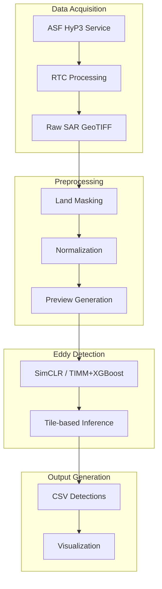

# SAR Eddy Detection Demo

A unified orchestrator for ocean eddy detection from Synthetic Aperture Radar (SAR) imagery. This tool integrates HyP3 data download, preprocessing, and machine learning inference into a single configurable workflow.

## Table of Contents

- [Overview](#overview)
- [Quick Start](#quick-start)
- [Installation](#installation)
- [Configuration](#configuration)
- [Usage Examples](#usage-examples)
- [CLI Overrides](#cli-overrides)
- [Directory Structure](#directory-structure)
- [Workflow Modes](#workflow-modes)
- [Outputs](#outputs)
- [Migration Notes](#migration-notes)

## Overview

This project provides a complete pipeline for SAR-based eddy detection, from raw satellite data acquisition to final visualization. The workflow supports multiple detection models and can run in different modes depending on your needs.

### Key Features

- **End-to-End Pipeline**: Download -> preprocess -> detect -> visualize
- **Multiple Models**: SimCLR and TIMM+XGBoost detection algorithms
- **Flexible Execution**: Run complete workflow or individual stages
- **HyP3 Integration**: Automated SAR data download from ASF HyP3 service
- **Configurable Processing**: Easy parameter adjustment via configuration files



## Quick Start

### 30-Second Setup

1.  **Install dependencies**:

    ```bash
    conda create --name sar_eddy_env python=3.10 pandas rasterio libgdal geopandas shapely tqdm pyyaml pytorch torchvision timm scikit-learn xgboost hydra-core hyp3_sdk -c conda-forge
    ```

2.  **Run complete workflow** (download + process + detect):

    ```bash
    python src/main.py
    ```

3.  **Run detection only** (on existing processed data):

    ```bash
    python src/main.py mode=inference_only paths.processed_dir=data/
    ```

4.  **Use TIMM+XGBoost model** instead of default SimCLR:

    ```bash
    python src/main.py mode=inference_only inference=timm_xgb paths.processed_dir=data/
    ```

## Installation

For full details on installation—including setting up with Conda or venv/pip and platform-specific notes—please refer to the [Installation Guide](INSTALLATION.md).

If you already have Conda on your system, you can do:

```bash
conda create --name sar_eddy_env python=3.10 pandas rasterio libgdal geopandas shapely tqdm pyyaml pytorch torchvision timm scikit-learn xgboost hydra-core hyp3_sdk -c conda-forge
```

## Configuration

We use [Hydra](https://hydra.cc/) to implement a hierarchical configuration system that enables flexible workflow control and easy parameter customization. The configuration structure promotes modularity and allows for CLI overrides.

### Configuration Structure

```
config/
├── config.yaml               # Main config with paths and mode control
├── hyp3/
│   └── default.yaml          # HyP3 download parameters
├── preprocessing/
│   └── default.yaml          # Land masking & normalization settings
└── inference/
    ├── default.yaml          # Default SimCLR detection model
    └── timm_xgb.yaml         # TIMM+XGBoost model configuration
```

### Key Configuration Files

**Main Configuration (`config/config.yaml`)**:

```yaml
defaults:
  - hyp3: default  # config/hyp3/default.yaml
  - preprocessing: default  # config/preprocessing/default.yaml
  - inference: default  # config/inference/default.yaml
  - _self_

mode: "full"  # "hyp3_only", "inference_only", or "full"

paths:
  download_dir: "data/downloaded/"
  processed_dir: "data/processed/"
  output_dir: "output/"
  # ... other paths
```

**Inference Configuration (`config/inference/default.yaml`)**:

```yaml
detector_class_name: "SimCLREddyDetector"

paths:
  output_dir: ${paths.output_dir}         # Inherits from global
  geotiff_dir: ${paths.processed_dir}     # Uses processed data by default

dataset_params:
  window_size: 700
  stride_factor: 0.25
  # ... other dataset parameters

device: "cpu"
batch_size: 128
# ... other inference settings
```

This structure ensures that:

  - Each component is self-contained with its required paths
  - Global paths can be overridden per-component
  - CLI overrides work intuitively
  - Workflow transitions (HyP3 -> Preprocessing -> Inference) are seamless

### Configuration Groups

  - **`hyp3`**: ASF credentials, granule lists, RTC processing parameters
  - **`preprocessing`**: Land masking, intensity clipping, format conversion options
  - **`inference`**: Model selection, detection parameters, dataset tiling settings

## Usage Examples

### Full Workflow Examples

**Default SimCLR Pipeline**:

```bash
python src/main.py mode=full
```

**TIMM+XGBoost with Custom Granules**:

```bash
python src/main.py mode=full inference=timm_xgb \
  hyp3.granules='["S1A_IW_GRDH_1SDV_20250107T020747_20250107T020812_057332_070E18_F91B", "S1A_IW_GRDH_1SDV_20250114T015820_20250114T015849_057434_071221_90CF"]'
```
Here, `inference=timm_xgb` uses `config/inference/timm_xgb.yaml` for the TIMM+XGBoost model.

**Skip HyP3 Download** (use existing processed data):

```bash
python src/main.py mode=inference_only paths.processed_dir=data/
```

### Stage-Specific Examples

**HyP3 Download & Preprocessing Only**:

```bash
python src/main.py mode=hyp3_only
```

**Inference with Custom Input Directory**:

```bash
python src/main.py mode=inference_only paths.processed_dir=/path/to/custom/tiles
# or equivalently, use inference.geotiff_dir=/path/to/custom/tiles
```

**Run Custom Model with Different Output Directory**:

```bash
python src/main.py mode=inference_only inference=timm_xgb \
  inference.output_dir=output/experiment_1
```

### Ten-Class (TenGPP) SimCLR Inference

Run the 10-class classifier and select which classes count as positives:

```bash
# Activate your environment first
conda activate sar_eddy_env

# Example: point to your 10-class checkpoint
python src/main.py mode=inference_only inference=simclr_10class \
  inference.geotiff_dir=data/processed \
  inference.output_dir=output/ten_class \
  inference.pretrain=model_checkpoints/10class_checkpoint.tar
```


Outputs now include pred_class in both the raw and merged CSVs. If you provide `inference.class_names`, a `pred_label` column will also be added.

Optional: split previews and tiles into per-class folders by enabling `inference.split_preview_by_class=true`. When enabled, scene previews and saved tiles will be grouped by `pred_label` (if provided) or `pred_class`.

Examples:

```bash
python src/main.py mode=inference_only inference=simclr_10class \
  inference.geotiff_dir=data/processed \
  inference.output_dir=output/ten_class \
  inference.class_names='["pure ocean waves", "wind streaks", "micro convective cells", "rain cells", "biological slicks", "sea ice", "icebergs", "low wind area", "atmospheric front", "oceanic front"]' \
  inference.split_preview_by_class=true
```

### Large Granule Lists (Hydra-friendly)

For very large batches (e.g., 10,000 granules), avoid pasting lists on the CLI or editing `config/hyp3/default.yaml`. Instead, create a **granule list config** and point Hydra at it:


1)  Create **`config/hyp3/granules_batch.yaml`** that *extends* the base `hyp3/default.yaml` and only overrides the `granules` list:

```yaml
# config/hyp3/granules_batch.yaml
defaults:
  - default  # inherit hyp3/default.yaml

granules:
  - S1A_IW_GRDH_1SDV_20190105T135220_20190105T135245_025343_02CE16_D8E2
  - S1A_IW_GRDH_1SDV_20190105T135245_20190105T135310_025343_02CE16_2590
  # ... thousands more
```

2) Use `granules_batch` in place of `default` in your CLI command:
```bash
# If the file is inside this repo:
python src/main.py hyp3=granules_batch

# If the file lives outside the repo:
python src/main.py --config-dir /path/to/my-configs hyp3=granules_batch
```

This keeps all keys from `hyp3/default.yaml` (e.g., `job_parameters`) and replaces only `granules`. Learn more: **[Extending Configs](https://hydra.cc/docs/patterns/extending_configs/)**.

#### Option B — Compose both options from the group on the CLI

Select **both** `default` and your `granules_batch` at runtime so they compose (with your batch list applied last):

```bash
# Inside the repo
python src/main.py hyp3=[default,granules_batch]

# Using an external config directory
python src/main.py --config-dir /path/to/my-configs hyp3=[default,granules_batch]
```

This keeps everything from `default` and overrides only the `granules` key from `granules_batch`. Learn more: **[Selecting multiple configs from a Config Group](https://hydra.cc/docs/patterns/select_multiple_configs_from_config_group)**.

## CLI Overrides

You can override any configuration parameter at runtime using dot-notation.

### Path Overrides

```bash
# Use custom input tiles directory
python src/main.py mode=inference_only \
  inference.geotiff_dir=/custom/tiles

# Change output directory
python src/main.py mode=inference_only \
  inference.output_dir=output/experiment_1

# Override global paths that affect all components
python src/main.py mode=full \
  paths.processed_dir=data/my_processed_scenes
```

### Model Configuration Overrides

```bash
# Change detection parameters
python src/main.py mode=inference_only \
  inference.batch_size=64 \
  inference.device=cuda \
  inference.dataset_params.window_size=512

# Use different model with custom parameters
python src/main.py mode=inference_only inference=timm_xgb \
  inference.arch=resnet50.a1_in1k \
  inference.pipeline_path=models/custom_pipeline.pkl
```

### Modular Configuration Overrides

```bash
# Use a completely custom inference configuration
python src/main.py mode=inference_only +inference=@my_custom_inference.yaml

# Mix and match components
python src/main.py mode=full \
  hyp3=my_custom_hyp3 \
  preprocessing=high_quality \
  inference=timm_xgb
```

## Directory Structure

For complete project layout details, see [STRUCTURE.md](STRUCTURE.md).

### Key Directories

  - **`config/`**: Configuration files for all workflow components
  - **`src/main.py`**: Main workflow orchestrator
  - **`src/sar_utils/`**: HyP3 download & preprocessing modules
  - **`src/eddy_detector/`**: Detection model implementations
  - **`src/models/`**: Model loading utilities

## Workflow Modes

The `mode` parameter controls which processing stages to execute:

| Mode | Stages | Use Case |
|------|--------|----------|
| `full` | Download -> Preprocess -> Detect | Complete end-to-end processing |
| `hyp3_only` | Download -> Preprocess | Data preparation and validation |
| `inference_only` | Detect only | Model testing and evaluation |

## Outputs

The workflow generates organized output files based on the detection results:

```
output/                                     # Default output directory
+-- positive_eddy_identifications.csv     # Primary detection results
+-- previews_0.999/                         # Visualization images
|   +-- *.png                             # SAR scenes with detection overlays
+-- timm_xgboost/                           # Model-specific subdirectory
    +-- positive_eddy_identifications.csv # TIMM+XGBoost results
    +-- previews_0.999/
        +-- *.png
```

### Output File Types

  - **Detection CSV**: Bounding box coordinates, confidence scores, and metadata for each detected eddy
  - **Visualization PNG**: SAR imagery with colored bounding boxes overlaying detected eddies
  - **Processing Logs**: Detailed execution logs saved to `logs/` directory for debugging and analysis

### CSV Format

The detection results contain the following columns:

  - `scene_id`: SAR scene identifier
  - `bbox`: Bounding box coordinates `[xmin, ymin, xmax, ymax]`
  - `confidence`: Model confidence score (0-1)
  - `longitude`, `latitude`: Geographic coordinates of detection center

## Migration Notes

**Breaking Changes**: This version includes two major configuration updates:

### Hydra Configuration System (Previous Update)

Replaced the argparse-based configuration system:

  - **Old syntax**: `python src/main.py --config config/inference.yaml`
  - **New syntax**: `python src/main.py inference=default`

### Flattened Configuration Structure (Latest Update)

**BREAKING CHANGE**: Removed nested `paths:` blocks from all configuration files.

#### Updated Configuration Structure

**Old format (nested paths):**
```yaml
# ❌ Old nested structure (no longer supported)
inference:
  paths:
    output_dir: "output/"
    geotiff_dir: "data/processed/"
```

**New format (flattened):**
```yaml
# ✅ New flattened structure
inference:
  output_dir: "output/"
  geotiff_dir: "data/processed/"
```

#### Updated CLI Overrides

**Old CLI syntax:**
```bash
# ❌ No longer works
python src/main.py inference.paths.output_dir=output/experiment_1
```

**New CLI syntax:**
```bash
# ✅ Use flattened paths
python src/main.py inference.output_dir=output/experiment_1
```

#### Code Migration Required

If you have custom code accessing configuration paths, update:

```python
# ❌ Old code (no longer works)
output_dir = cfg.inference.paths.output_dir

# ✅ New code
output_dir = cfg.inference.output_dir
```

### Key Benefits

1.  **Simplified Command Line**: No need to specify config file paths or nested paths
2.  **Easy Overrides**: Change any parameter with `key=value` syntax  
3.  **Composable Configs**: Mix and match configuration components
4.  **Better Validation**: Automatic type checking and error reporting
5.  **Cleaner Structure**: Direct access to path configurations without nesting

<!-- ## Contributing

Contributions to improve the detection algorithms, add new models, or enhance the workflow are welcome.

### Development Guidelines

1.  **Configuration Changes**: Add new config groups under `config/<group>/`
2.  **Parameter Updates**: Update defaults in `config/config.yaml`
3.  **CLI Testing**: Verify that parameter overrides work correctly
4.  **Documentation**: Update this README with new usage examples

For detailed guidelines, see [CONTRIBUTING.md](CONTRIBUTING.md).

## Support

  - **Issues**: Report problems via [suspicious link removed]
  - **Discussions**: Ask questions in [suspicious link removed]
  - **Documentation**: Check [INSTALLATION.md](INSTALLATION.md) and [STRUCTURE.md](STRUCTURE.md) for detailed info -->

<!-- end list -->