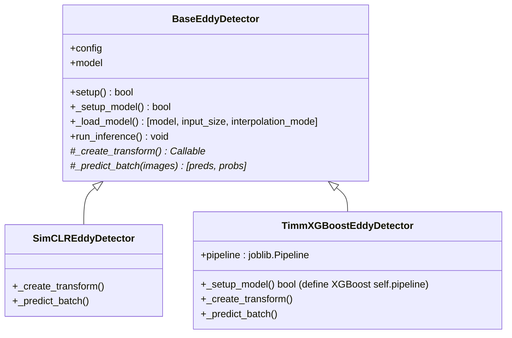
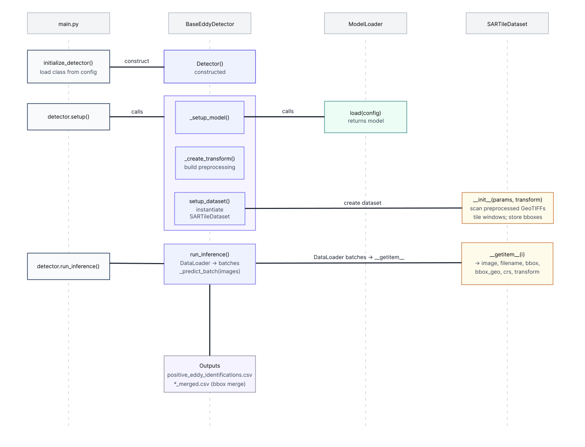

# Eddy Detector Module (`src/eddy_detector`)

This directory contains the pluggable detection "engines" that identify ocean eddies in SAR imagery. The system is designed for extensibility, allowing different **machine learning models** and **datasets** to be easily swapped via YAML configs while reusing a common, robust workflow.

### Quick Start

Run inference from the repository root using a specific detector configuration.

```bash
# Run with the default SimCLR detector
python src/main.py mode=inference_only
```

```bash
# Switch to the TIMM+XGBoost detector
python src/main.py mode=inference_only inference=timm_xgb
```

> **⚠️ Input Prerequisite:** The detection workflow requires **preprocessed** GeoTIFFs (e.g., land-masked and normalized). The dataset module will raise an error if it receives raw, unprocessed files. Ensure `inference.geotiff_dir` points to your processed data directory. The preprocessing can be done using the utilities in [`sar_utils/preprocess_land_mask_and_normalize.py`](../sar_utils/preprocess_land_mask_and_normalize.py). You can also run `src/main.py` in `hyp3_only` mode to download and preprocess data from the Alaska Satellite Facility's [HyP3](https://hyp3-docs.asf.alaska.edu/) service.

-----

### How It Works: The Template Method Pattern

The architecture is built on the **Template Method** design pattern. A base class, `BaseEddyDetector`, defines the skeleton of the detection algorithm (setup, data loading, batch inference, saving results), but leaves the model-specific details to be implemented by subclasses.

This means you only need to provide three key pieces to add a new `Detector`:

1.  `_setup_model()`: **How to load the model** and prepare it for inference.

    - This is optional; the default `_setup_model()` in BaseEddyDetector will call `ModelLoader.load()` to assign `self.model`.
    - You can change this if you need something custom in addition to `self.model`.
    - It should mainly set `self.model` to be used in `_predict_batch()`, and optionally set `self.input_size` and `self.interpolation_mode` if your model requires specific input dimensions or interpolation methods.
    - Additional attributes can be defined here (e.g., scikit-learn pipelines, model-specific parameters) that will be used in `_predict_batch()`.

2.  `_create_transform()`: **How to preprocess an image tile** before feeding it into the model.
    - This should return a `Callable` (function) that takes a PyTorch tensor and returns a transformed tensor ready for the model.

3.  `_predict_batch(images)`: **How to get a prediction** from a batch of preprocessed tiles.
    - This should return a tuple of:
        - `predictions`: A NumPy array of predicted class indices.
        - `confidence_scores`: A NumPy array of confidence scores for each prediction.

The base class handles the rest of the boilerplate code for you.

**Core Components:**

  * `base_detector.py`: The abstract base class that defines the shared workflow.
  * `simclr_detector.py`: An end-to-end detector using a **SimCLR ResNet** model.
  * `timm_xgboost_detector.py`: A two-stage detector using a **TIMM model** for feature extraction and a `joblib`-saved pipeline (e.g., **XGBoost**) for classification.

<!-- end list -->



The main script (`src/main.py`) orchestrates this process, dynamically loading the detector and its dependencies based on the Hydra configuration.



-----

### How to Add a New Detector

Follow these three steps to integrate your own custom model into the workflow.

#### Step 1: Create the Detector Class

In `src/eddy_detector/`, create a new Python file (e.g., `my_detector.py`). Inside, define a class that inherits from `BaseEddyDetector` and implement the two required abstract methods.

```python
# src/eddy_detector/my_detector.py
from typing import Callable, Tuple
import numpy as np
import torch
from torchvision import transforms
from src.eddy_detector.base_detector import BaseEddyDetector

class MyDetector(BaseEddyDetector):
    """A new detector implementing our custom logic."""

    # optional: override _setup_model(self) if you need model loading beyond that provided by `ModelLoader` and self.model in your `_predict_batch()` function.

    def _create_transform(self) -> Callable:
        """Define the specific preprocessing for this model."""
        # self.input_size is available if set by your model loader in setup()
        return transforms.Compose([
            transforms.ToTensor(),
            transforms.Resize(self.input_size or (224, 224)),
            # ... add any other required normalization ...
        ])

    def _predict_batch(self, images: torch.Tensor) -> Tuple[np.ndarray, np.ndarray]:
        """Run the model and return predictions and their confidence scores."""
        outputs = self.model(images) # Assumes self.model is loaded by setup()
        probabilities = torch.softmax(outputs, dim=1)
        predictions =torch.argmax(probabilities, dim=1)

        # Get the confidence score for the *predicted* class for each item in the batch
        confidence_scores = probabilities[torch.arange(len(predictions)), predictions]

        return predictions.cpu().numpy(), confidence_scores.cpu().numpy()
```

#### Step 2: Create a New Configuration

In `config/inference/`, add a new YAML file (e.g., `my_detector.yaml`). You can inherit from `default.yaml` to avoid repeating settings.

```yaml
# config/inference/my_detector.yaml
defaults:
  - default # Inherit common settings like batch_size, workers, etc.

# Point to the new detector class (module.file.ClassName)
detector_class_name: "src.eddy_detector.my_detector.MyDetector"

# Specify the model architecture and loader for your new model
model_loader_class: "src.models.my_loader.MyLoader" # Create this loader if needed
arch: "efficientnet_b0"
# ... any other model-specific parameters ...
```


#### Step 3: Run the Pipeline

Execute the main script and tell Hydra to use your new inference configuration. The name of the configuration group is the name of your YAML file (`my_detector`).

```bash
python src/main.py mode=inference_only inference=my_detector
```

> Note: While we recommend creating a new config file, you can also pass this configuration directly via the command line. For example:

```bash
python src/main.py mode=inference_only inference.detector_class_name=src.eddy_detector.my_detector.MyDetector \
  inference.model_loader_class=src.models.my_loader.MyLoader \
  inference.arch=efficientnet_b0
```
-----

### Public API and Key Considerations

Once instantiated, all detectors, share a common public API and behavior.

**Core Methods:**

```python
# Main workflow methods
detector.setup()         # loads model/pipeline, builds transforms, creates dataset
detector.run_inference() # batches tiles, writes CSV + *_merged.csv

# Optional visualization methods
detector.create_scene_previews_with_bbox(confidence_threshold=0.9, merged=True)
detector.save_positive_detection_tiles(confidence_threshold=0.5, patch_size=256)
```

**Key Considerations:**

  * **Output CSV Location:** Detections are saved to the directory specified by `inference.output_dir`. Raw detections are named based on `inference.identification_table_path`, and a second file, `*_merged.csv`, is created after bounding box merging.
  * **Positive Class:** The system relies on `inference.positive_class_index` (default: `1`) to identify eddy detections for saving and visualization.
  * **Model Loading:** The base detector handles loading the model via the class specified in `model_loader_class`. Ensure your model loader returns the `model`, its expected `input_size`, and `interpolation_mode`.